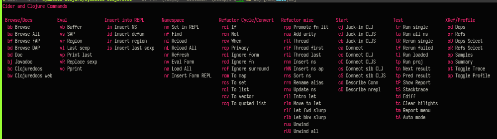

# Cider Transient

Collect the most useful/common cider (and clojure) commands into a
transient menu.

There are very many cider and clojure commands from `C-c ...' and then a
series of more keypresses. This aims to collect all the most important ones
into a single menu. It helps with memory, discoverability, and speed.

They quick shortcut (key binding) I use is `CC`. This enables, eg, `CCtr` to
do a single _test run_. Whereas, CIDER's default binding is `C-c C-t C-t`. OK,
for this case CIDER's is actually better, but for a lot of cases,
cider-transient is nice to have. I actually use CIDER's bindings frequently,
but I find that there are too many of them, and they clash with some others
that like to define, so I'm considering removing all of them.

    (key-chord-define-global "CC" 'cider-transient)
